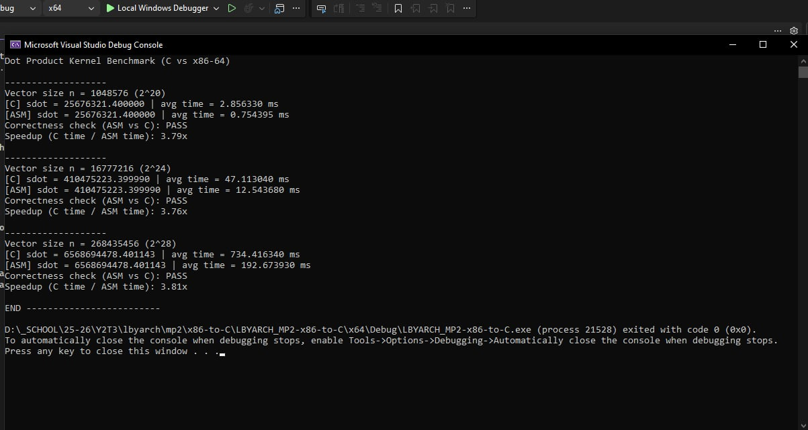
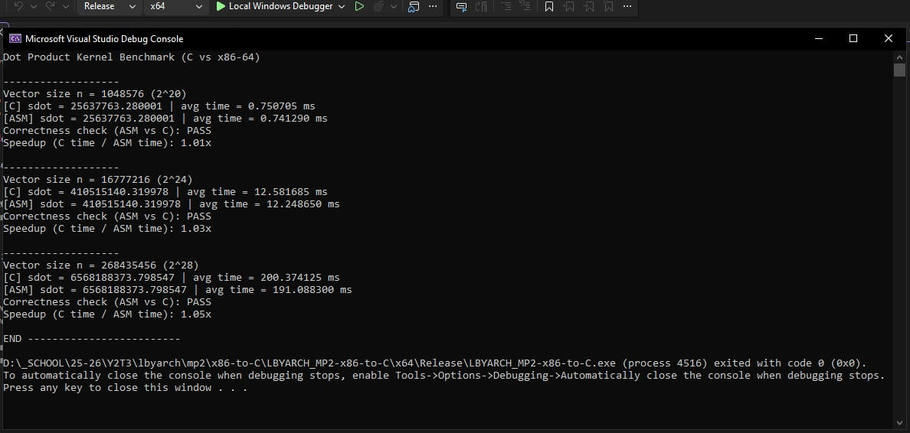

# LBYARCH_MP2-x86-to-C

**Group members:** Degullado, Joseph Edward Kelvin & Romero, Aaron Zander

## How to compile and run
1. Run x64 Native Tools Command Prompt for VS
2. `cd /d "where you saved"`
3. `ml64.exe /c kernel.asm` — Generate .obj file for kernel
4. `cl.exe main.c kernel.obj /Fe: MP2.exe` — Compile with C and link with the assembly file
5. `MP2.exe` — Run compiled program

## Results

| Vector Size (n) | C avg time (ms) | ASM avg time (ms) | C ns/element | ASM ns/element | Correctness | Speedup (C/ASM) |
|---|---|---|---|---|---|---|
| 2^20 (1,048,576) | 3.116290 | 0.980375 | 2.972 | 0.935 | PASS | **3.18x** |
| 2^24 (16,777,216) | 52.287355 | 18.324710 | 3.117 | 1.092 | PASS | **2.85x** |
| 2^28 (268,435,456) | 827.280770 | 295.389725 | 3.082 | 1.100 | PASS | **2.80x** |

*sdot values matched exactly between C and ASM for all three sizes (25653471.679999, 410621188.039940, and 6568514807.480904 respectively), confirmed via the epsilon-based correctness check in `main.c`.*

### Screenshot Debug (Program Output with Correctness Check)

### Screenshot Release (Program Output with Correctness Check)

## Comparative Analysis

Across all three vector sizes, the x86-64 assembly kernel consistently outperformed the C kernel, with speedups ranging from **2.80x to 3.18x**. Correctness held throughout as every run reported PASS, with the ASM result matching the C result within the epsilon-based tolerance that was defined in `main.c`.

Analyzing furthermore, the C kernel spends a fairly constant **~3.0–3.1 ns per element** regardless of vector size, while the assembly kernel spends **~0.94 ns per element** at the smallest size and rises slightly to **~1.09–1.10 ns per element** at the two larger sizes. There are two findings we concluded:

1. **The assembly loop has less per-iteration overhead.** The loop in `kernel.asm` consisting of two `movsd` loads, one `mulsd`, one `addsd`, an increment, a compare, and a jump. The compiled C loop carries extra bookkeeping per iteration, so it needs more cycles to do the same multiply-accumulate work. This overhead advantage is largest at the smallest size (3.18x), since fixed per-iteration cost is a bigger fraction of a short-running loop.

2. **The speedup narrows slightly as n grows (3.18x → 2.85x → 2.80x) because the workload shifts from compute-bound to memory-bound.** A dot product performs only one multiply and one add per 16 bytes loaded, which is a very low ratio of computation to memory traffic. At 2^20 elements, both vectors can mostly fit in cache, so the assembly kernel's lower instruction overhead is fully expressed as speed. At 2^24 and 2^28 elements, the vectors are far larger than any cache so both kernels spend an increasing share of their time waiting on data to arrive from main memory rather than executing instructions. Since memory bandwidth is a hardware limit shared by both versions which compresses, but doesn't eliminate, the gap between them.

**Conclusion:** The assembly kernel wins at every size because scalar SSE2 instructions (`movsd`/`mulsd`/`addsd`) let it do the same arithmetic with fewer, more direct instructions than the compiled C loop. The advantage is most pronounced when the data fits in cache and the workload is instruction-bound. It shrinks somewhat at large n as both versions converge toward the memory bandwidth ceiling of the machine.

## Video
[Demo Video](demovideo.mp4)
Link: https://drive.google.com/file/d/13Hxho1flwsBpn4HVim4NNmZh5xm79Zc3/view?usp=sharing
