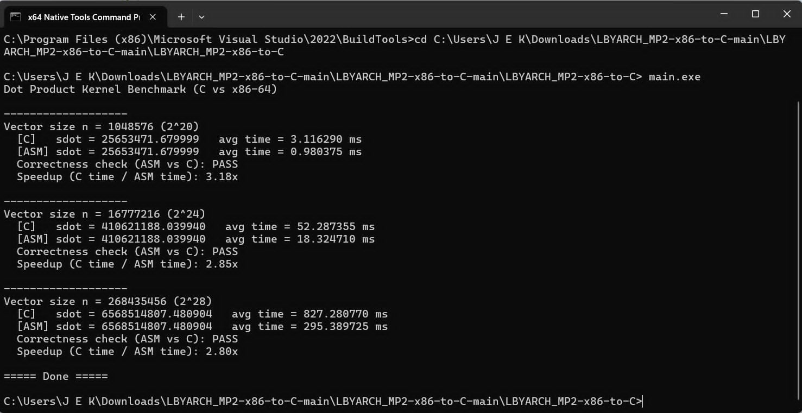

# LBYARCH_MP2-x86-to-C

How to compile and run:
1. Run x64 Native Tools Command Prompt for VS
2. cd /d "where you saved"
3. ml64.exe /c kernel.asm - Generate .obj file for kernel
4. cl.exe main.c kernel.obj /Fe: MP2.exe - Compile with C and link with the assembly file
5. MP2.exe - Run compiled program

## Program Output

## Video Demonstration
[Short Demo Video](2026-08-06 22-35-06.mp4)